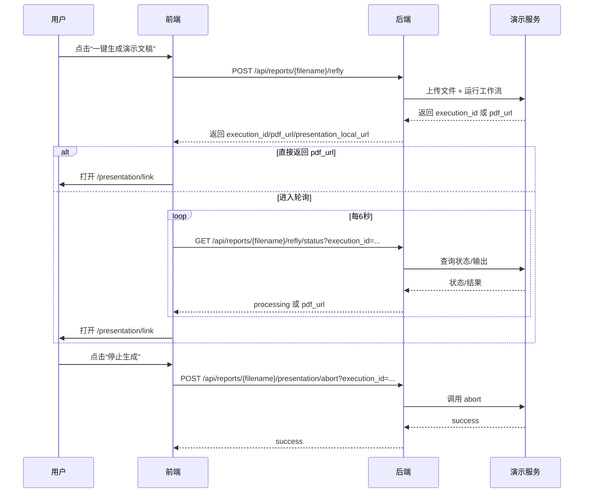
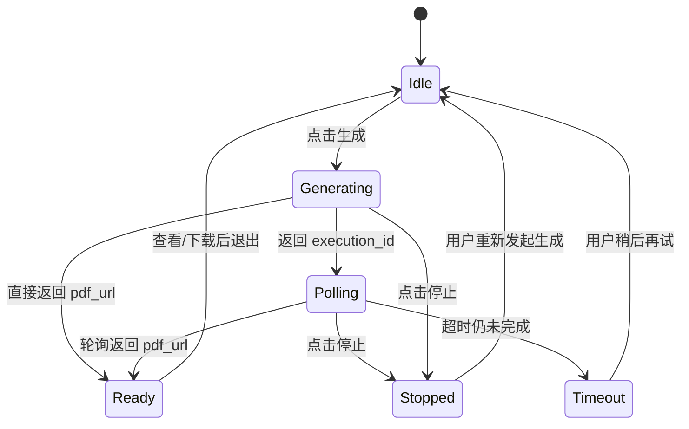

# 一键生成演示文稿对接说明

## 一、接口清单（用途 + 触发时机）

1) 触发生成  
`POST /api/reports/<filename>/refly`  
- 返回 `execution_id` 时进入轮询  
- 若立即返回 `pdf_url` 或 `presentation_local_url`，可直接打开

2) 轮询状态（执行中）  
`GET /api/reports/<filename>/refly/status?execution_id=...`  
- 返回 `pdf_url` 表示生成完成  
- 否则继续轮询

3) 页面恢复状态  
`GET /api/reports/<filename>/presentation/status`  
- 页面加载时检查是否已有结果或仍在生成中

4) 打开演示文稿  
`GET /api/reports/<filename>/presentation/link`  
- 重定向到最终 pdf 链接（优先）

5) 获取演示文稿文件  
`GET /api/reports/<filename>/presentation`  
- 如果下载过演示文稿，直接返回本地文件

6) 停止生成  
`POST /api/reports/<filename>/presentation/abort?execution_id=...`  
- 中止生成并停止轮询

---

## 二、最小流程伪代码（前端）

```js
async function generatePresentation(filename) {
  // 1) 触发生成
  const res = await POST(`/api/reports/${filename}/refly`);

  // 2) 直接返回 url -> 打开
  if (res.pdf_url || res.presentation_local_url) {
    open(`/api/reports/${filename}/presentation/link`);
    return;
  }

  // 3) 进入轮询
  const executionId = res.execution_id;
  pollStatus(filename, executionId);
}

function pollStatus(filename, executionId) {
  const timer = setInterval(async () => {
    const status = await GET(`/api/reports/${filename}/refly/status?execution_id=${executionId}`);
    if (status.pdf_url) {
      clearInterval(timer);
      open(`/api/reports/${filename}/presentation/link`);
    }
  }, 6000);
}

async function stopPresentation(filename, executionId) {
  await POST(`/api/reports/${filename}/presentation/abort?execution_id=${executionId}`);
  stopPolling();
}
```

---

## 三、页面恢复逻辑（刷新 / 回到报告页）

```js
async function recoverStatus(filename) {
  const status = await GET(`/api/reports/${filename}/presentation/status`);
  if (status.processing && status.execution_id) {
    pollStatus(filename, status.execution_id);
  } else if (status.pdf_url) {
    // 已完成，可直接展示“查看演示文稿”
  }
}
```

---

## 四、接口返回字段清单

### 1) POST `/api/reports/<filename>/refly`
成功时可能返回：
```json
{
  "message": "已提交生成任务",
  "execution_id": "we-xxxx",
  "presentation_url": "https://...",
  "pdf_url": "https://...",
  "presentation_local_url": "/api/reports/<filename>/presentation",
  "download_url": "https://...",
  "download_path": "/Users/xxx/Downloads/...",
  "download_filename": "xxx.pdf",
  "download_size": 123456,
  "refly_upload": {...},
  "refly_status": {...},
  "refly_response": {...}
}
```

生成中/超时时：
```json
{
  "processing": true,
  "execution_id": "we-xxxx",
  "message": "演示文稿仍在生成中，请稍后重试"
}
```

### 2) GET `/api/reports/<filename>/refly/status?execution_id=...`
完成时：
```json
{
  "execution_id": "we-xxxx",
  "pdf_url": "https://..."
}
```

未完成时：
```json
{
  "processing": true,
  "execution_id": "we-xxxx",
  "refly_status": {...},
  "refly_response": {...}
}
```

### 3) GET `/api/reports/<filename>/presentation/status`
完成时：
```json
{
  "pdf_url": "https://...",
  "presentation_local_url": "/api/reports/<filename>/presentation"
}
```

生成中：
```json
{
  "processing": true,
  "execution_id": "we-xxxx"
}
```

### 4) GET `/api/reports/<filename>/presentation/link`
- 302 重定向到最终 PDF 链接（若不存在返回 404）

### 5) GET `/api/reports/<filename>/presentation`
- 直接返回本地存储的演示文稿文件（若不存在返回 404）

### 6) POST `/api/reports/<filename>/presentation/abort?execution_id=...`
成功时：
```json
{
  "success": true,
  "execution_id": "we-xxxx"
}
```

---

## 五、错误处理与超时策略建议

1) 轮询超时
- 建议：轮询 20 分钟后自动停止
- 提示：生成时间较长，请稍后在“演示文稿”处查看

2) 接口异常
- `timeout/ssl/http` → 提示：网络不稳定，已继续等待
- 其他错误 → 提示：生成失败，请重试

3) 停止生成
- 停止后：清空轮询、提示“已停止生成”
- 支持再次点击“生成”

---

## 六、全链路时序图



---

## 七、前端状态机



---

## 八、前端关键状态变量（对齐现有实现）

- `generatingSlides`：生成中
- `presentationPolling`：轮询中
- `presentationExecutionId`：执行 id（停止/轮询时用）
- `presentationPdfUrl`：完成后的 pdf 链接
