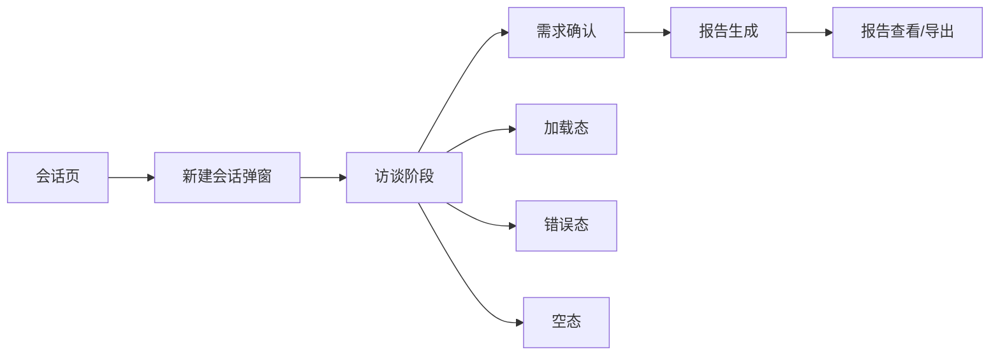
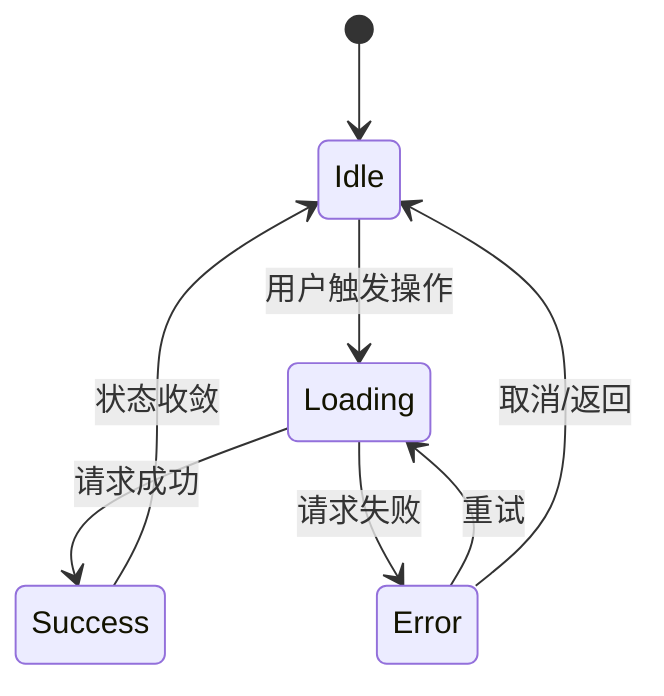

# DeepVision 体验改造蓝图（首发版）

## 1. 核心流程重构图（首发）

设计原则：
- 主路径优先，次要能力后置。
- 每一步都有「可理解状态」与「可恢复入口」。
- 全状态对齐（正常/加载/空/错）。

## 2. 页面信息层级

### `index`
- 顶层：导航、主题、状态。
- 中层：会话/访谈/报告三大工作区。
- 底层：反馈与系统层（弹窗、Toast）。

### `help`
- 顶层：品牌与全局入口。
- 中层：目录导航 + 内容主体。
- 底层：FAQ 与支持反馈。

### `intro`
- 顶层：品牌叙事与价值承诺。
- 中层：能力说明与适用场景。
- 底层：CTA 引导回主流程。

## 3. 交互状态机（统一）

统一规则：
- `Loading`：按钮禁用 + 明确文案。
- `Error`：错误文案可理解、可行动（重试/返回）。
- `Success`：短反馈 + 自动回收（Toast）。

## 4. 组件语义契约

### 弹窗
- 契约字段：`dialogId/titleId/descId/initialFocus/returnFocus`。
- 行为：打开自动聚焦，关闭优先返回触发源。
- 来源：`SITE_CONFIG.a11y.dialogs`。

### Toast
- 契约字段：`type/message/action/announceMode`。
- 行为：按类型映射 `role` 与 `aria-live`。
- 来源：`SITE_CONFIG.a11y.toast`。

## 5. 首发验收门槛

- 键盘可完成会话创建、删除确认、报告操作。
- 弹窗均具备标题与描述语义关系。
- 错误 Toast 对读屏可感知（`alert/assertive`）。
- 主题切换后，`index/help/intro` 品牌色与文本层级一致。

